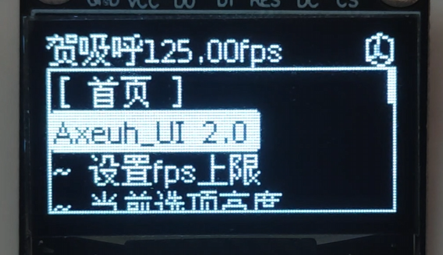

# Arduino 交互式UI系统

基于Arduino平台和Axeuh_UI库开发的综合界面系统，集成多级菜单、动态图形、3D渲染和硬件交互功能。基于U8G2库实现高性能显示驱动。



## 目录
- [功能特性](#功能特性)
- [硬件要求](#硬件要求)
- [快速开始](#快速开始)
  - [安装依赖](#安装依赖)
  - [硬件连接](#硬件连接)
  - [代码配置](#代码配置)
- [系统架构](#系统架构)
- [核心类说明](#核心类说明)
- [使用示例](#使用示例)
- [API参考](#api参考)
- [开发指南](#开发指南)
- [常见问题](#常见问题)
- [许可证](#许可证)

---

## 功能特性

### 核心功能
- **多级菜单系统**
  - 支持无限级菜单嵌套
  - 动态菜单项生成（`MenuOption`结构）
  - 图文混合显示（`PICTURE_TEXT`模式）
  - 菜单动画过渡效果（渐进动画函数）

- **图形渲染引擎**
  - 128x64 OLED显示驱动（U8G2集成）
  - GIF动画支持（`Menu_gif`结构）
  - 实时3D立方体渲染（`Axeuh_UI_Cube`类）
  - 自定义字体支持（UTF-8编码）

- **交互组件库**
  - 参数滑动调节条（`Axeuh_UI_slider`类）
  - 中文拼音输入键盘（`Axeuh_UI_Keyboard`类）
  - 状态栏组件（`Axeuh_UI_StatusBar`类）
  - 对话框和Toast提示

- **系统特性**
  - 异步UI刷新（最高240FPS，`menu_display_xtaskbegin`）
  - 硬件中断优化（`xSemaphore`互斥锁）
  - 动态内存管理（`CharLenMap`字符缓存）
  - 低功耗模式支持

### 扩展功能
- 串口配置接口
- 主题切换（亮色/暗色）
- 屏幕旋转支持（0°/90°/180°/270°）
- 多语言支持框架

---

## 硬件要求

### 必需组件
| 组件               | 规格要求           | 推荐型号         | 接口说明       |
|--------------------|--------------------|------------------|----------------|
| 主控板             | 支持Arduino框架    | ESP32 DevKit     | -              |
| OLED显示屏         | 128x64分辨率       | SSD1306          | SPI/I2C        |
| 输入设备           | 5向导航+确认键     | EC11编码器       | GPIO中断       |

### 推荐配置
- **处理器性能**
  - Flash存储：≥4MB（用于存储图形资源）
  - SRAM：≥160KB（复杂界面需求）
  - 时钟速度：≥160MHz（流畅动画）

- **扩展功能**
  - 实时时钟模块（DS3231）
  - 锂电池管理电路
  - 蜂鸣器（交互反馈）

---

## 快速开始

### 安装依赖

#### PlatformIO
```ini
lib_deps =
    https://github.com/Wuqiyang312/Axeuh_UI_lib.git
```

#### Arduino IDE
1. 通过库管理器安装 `U8g2`
2. 下载[Axeuh_UI库ZIP](https://github.com/Wuqiyang312/Axeuh_UI_lib/archive/main.zip)
3. 菜单栏：项目 > 加载库 > 添加.ZIP库

### 硬件连接
```cpp
/* 典型接线示例 (ESP32) */
#define OLED_SDA  21  // I2C数据线
#define OLED_SCL  22  // I2C时钟线
#define ENC_A     34  // 编码器A相
#define ENC_B     35  // 编码器B相 
#define ENC_SW    36  // 编码器按键
```

### 基础配置
```cpp
#include <Axeuh_UI.h>
#include <U8g2lib.h>

U8G2_SSD1306_128X64_NONAME_F_HW_I2C u8g2(U8G2_R0);
Axeuh_UI UI(&u8g2);

void setup() {
  UI.begin();
  
  // 添加主菜单项
  UI.addMenu("控制面板", showDashboard);
  UI.addMenu("参数设置", showSettings);
}

void loop() {
  UI.update();
}
```

---

## 系统架构

### 组件框图
```
┌─────────────────┐
│   用户输入      │←[硬件中断]
└───────┬─────────┘
        ↓
┌─────────────────┐
│  事件处理器     │→[消息队列]
└───────┬─────────┘
        ↓
┌─────────────────┐
│  UI渲染引擎     │←[帧同步]
└───────┬─────────┘
        ↓
┌─────────────────┐
│ 显示驱动(U8G2)  │→[SPI/I2C]
└─────────────────┘
```

### 关键设计
1. **事件驱动模型**
   - 中断采集输入（`IN_PUT_Mode`枚举）
   - 非阻塞式事件处理（`xTaskCreatePinnedToCore`）
   - 双缓冲渲染技术

2. **资源管理**
   - 预编译位图资源（`gif.h`）
   - 动态内存分配策略（`expand()`函数）
   - 对象复用池

---

## 核心类说明

### Axeuh_UI (主控类)
| 方法 | 说明 |
|------|------|
| `begin()` | 初始化UI系统 |
| `addMenu()` | 添加菜单项 |
| `animation()` | 渐进动画控制 |

### Axeuh_UI_Panel (面板容器)
```cpp
// 典型用法
Axeuh_UI_Panel mainPanel;
mainPanel.set(textMenu);  // 绑定文本菜单
mainPanel.set_interlude(0,0,0,0); // 设置动画参数
```

### Axeuh_UI_TextMenu (文本菜单)
```cpp
MenuOption options[] = {
  {"温度设置", 12, LEFT_CENTER, TEXT},
  {"亮度调节", 12, LEFT_CENTER, TEXT}
};
Axeuh_UI_TextMenu menu(options, 2);
```

### 特殊功能类
- `Axeuh_UI_Cube`：3D立方体渲染
- `Axeuh_UI_Keyboard`：中文输入法
- `Axeuh_UI_slider`：参数滑动条

---

## 使用示例

### 3D立方体动画
```cpp
Axeuh_UI_Cube cube;
cube.set_cube(64, 32, 15); // 中心位置，缩放系数

void loop() {
  cube.drawCube(&u8g2, &UI);
}
```

### 参数滑动条
```cpp
float brightness = 50;
Axeuh_UI_slider slider("亮度", &brightness, 0, 100);

void draw() {
  slider.drawSlider(&u8g2, UI.get_IN_now(), &panel, &UI);
}
```

### GIF动画显示
```cpp
Menu_gif anim(
  epd_bitmap_allArray1, // GIF帧数组
  30,                   // 总帧数
  64, 32,               // 位置
  32, 32,               // 尺寸
  100,                  // 播放速度(ms)
  0,                    // 起始帧
  AutoPlay              // 播放模式
);
```

---

## API参考

### 关键方法
| 类 | 方法 | 说明 |
|----|------|------|
| `Axeuh_UI` | `set_u8g2()` | 绑定显示驱动 |
| `Axeuh_UI_TextMenu` | `set_munber()` | 设置当前选中项 |
| `Axeuh_UI_Panel` | `set_interlude()` | 设置动画参数 |

### 回调函数类型
```cpp
typedef void (*textMenuCallback)(Axeuh_UI_Panel*, Axeuh_UI*);
typedef IN_PUT_Mode (*Axeuh_UI_input_callback)();
```

---

## 开发指南

### 自定义组件步骤
1. 继承 `UIComponent` 基类
2. 实现 `draw()` 和 `handleEvent()` 方法
3. 注册到系统组件池

### 性能优化建议
- 使用 `PROGMEM` 存储大尺寸位图
- 避免在循环中创建临时对象
- 启用字符缓存（`CharLenMap`）

---

## 常见问题

### Q1: 中文显示乱码
- 确保使用`u8g2_font_wqy12_t_gb2312`字体
- 检查文件编码为UTF-8

### Q2: 动画卡顿
- 增加任务堆栈大小（`uxPriority`参数）
- 降低GIF帧率

---

## 许可证
[Apache License v2](./LICENSE)